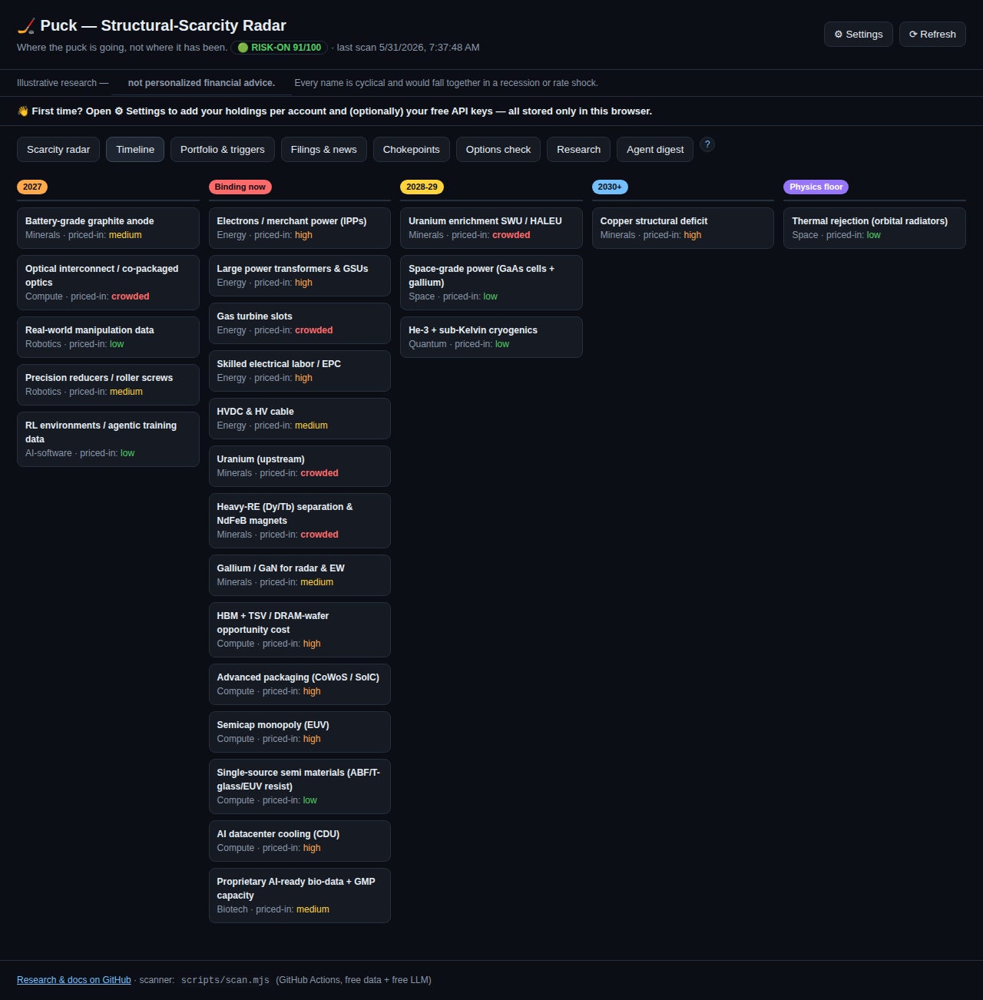

# Puck — End-User Guide

> **Not financial advice.** Puck is research tooling to inform *your own* judgment. Every name it
> tracks is cyclical and would fall together in a recession or rate shock. Prices and signals can be
> wrong or stale. Verify before you act, and consider a fiduciary advisor.

This guide explains **every feature**, **what each number means**, and **how to use it**. Screenshots
are auto-generated from the live app by the `docs` workflow, so they stay current as the app evolves.

---

## 1. What Puck is (the one-paragraph mental model)

Puck has one philosophy: **alpha from the scarcity research, timing from the tape.**
- The **alpha** is *what to own*: structural technology scarcities (chokepoints — power, grid, copper,
  uranium, rare earths, semis, etc.) that bind over 2026–2036, mapped to a real portfolio.
- The **timing** is *when to act*: a market-regime layer (trend + momentum + volatility + drawdown)
  that tells you when to deploy/go-all-in vs. when to apply the brakes and raise cash.

A free scanner runs daily on GitHub Actions, pulls free market data, computes everything, and commits
it to `web/data/signals.json`. The dashboard (hosted free on Vercel) just renders that file.

**The `?` buttons:** every section has a circular **?** help button that explains it in-app. This guide
is the long-form version.

---

## 2. Getting started (first 5 minutes)

1. **Open the dashboard** (your Vercel URL). You'll land on the **Scarcity radar**.
2. A **"First time?"** banner points you to **⚙ Settings** — open it.
3. **Add your holdings** per account (see §9). This is stored *only in your browser* — never uploaded.
4. *(Optional)* add **free API keys** (§9.2–9.3) to enable the AI digest and extra data cross-checks.
5. Use the tabs across the top to explore. Tap any **?** for context.

Nothing you enter in Settings is ever committed to the repo — it lives in your browser's localStorage.

---

## 3. Scarcity radar (the alpha)

Each row is a structural scarcity. **How to read the columns:**

| Column | Meaning | How to use it |
|---|---|---|
| **Scarcity** | The chokepoint + a one-line thesis. `◆ non-consensus` = under-appreciated. `▲ drift` = its priced-in level has changed since first tracked. | Hunt for non-consensus + low priced-in. |
| **Binds** | When it starts biting: `now → 2027 → 2028-29 → 2030+ → physics floor`. | Earlier = more urgent. |
| **Priced-in** | How much the market already reflects it: `low → medium → high → crowded`. | High/crowded = less edge left; low = more opportunity. |
| **Durability** | How long the moat lasts (`low → very-high`). | Favor very-high. |
| **Subst. risk** | Chance a substitute relieves the scarcity. | Lower is better. |
| **Crowding\*** | A **live 0–100** proxy from price action (YTD + distance to 52-week high). | Higher = more already-priced by the market *right now*. |
| **Tickers** | Investable proxies (some scarcities are private/foreign — no clean ticker). | — |

**Controls:** filter by **Sector**, or tick **non-consensus only** to see just the under-appreciated
theses. The durable edge is **low priced-in + high durability + low substitution risk**.

---

## 4. Timeline

The same scarcities, **bucketed by when they bind** (now → 2027 → 2028-29 → 2030+ → physics floor),
each tagged with its priced-in level. Use it to see *sequencing* — what bites first and what's a
longer-dated, more certain deficit (e.g., copper).

---

## 5. Portfolio & triggers

### 5.1 Timing posture (the regime)
The colored banner at the top is the **timing posture** — the heart of "when to act":

| Posture | Meaning | What to do |
|---|---|---|
| 🟢 **risk-on** (score ≥70) | Uptrend + positive 12-month momentum, contained volatility | Deploy on schedule / accelerate low-regret anchors |
| ⚪ **neutral** (45–69) | Mixed | Stick to the DCA calendar; no acceleration |
| 🟠 **caution** (25–44) | Trend/vol deteriorating | Tap the brakes — slow deploys, build dry powder |
| 🔴 **defensive** (<25) | Downtrend, drawdown, rising vol | Favor cash; deploy only into the drawdown trigger |

It's a **risk dial that paces your DCA**, not an all-in/all-out switch. It's built on *independent,
replicated* research (Faber 200-DMA trend; Moskowitz-Ooi-Pedersen time-series momentum; Moreira-Muir
volatility; Hurst-Ooi-Pedersen trend) — **not** a curve-fit backtest. Full detail: `REGIME.md`.

**Two overlays (Timing v2):**
- **Macro-stress brake (exit-only).** Forces *defensive* only when **two leading risk signals fire
  together** — the **VIX term-structure inverts** (front VIX ≥ VIX3M) **AND high-yield credit widens
  fast** (HYG ~1-month return ≤ −3%). Requiring both makes false alarms rare; being exit-only means it
  can only de-risk, never add. When it's on, the posture note shows **MACRO-STRESS**.
- **20-DMA fast re-entry.** When ≥60% of holdings reclaim their 20-day average, the posture **re-risks
  one notch** — so you don't stay in cash too long after a V-shaped bottom (the momentum-crash fix). The
  macro brake always wins over re-entry.

### 5.2 Summary cards
Sleeve size, IRA vs taxable split, holding count, and a **data-quality** card (✓ OK or ⚠ degraded —
see §11).

### 5.3 Triggers
Rules that tell you to act. Each shows a state — **armed** (active), **monitor** (manual watch), or
**fired** (condition met):
- **Drawdown** (auto): complex down ≥20–25% from highs → deploy dry powder.
- **Trim rule** (auto): a name >2× cost basis **and** >50× forward P/E → trim ⅓ (needs your cost basis
  from Settings).
- **Sleeve cap** (auto): sleeve value > ~$1.72mm → trim back (needs your holdings from Settings).
- **Policy triggers** (manual): e.g. rare-earth/uranium policy shifts.

When a trigger fires, the scanner opens a GitHub issue (deduped — one open issue at a time). **Auto
triggers are held on a degraded-data run** so bad data can't fire an action (§11).

### 5.4 Holdings table
Your **target plan**: account, target $, weight, **tier** (deployment pace), live price, YTD,
**% off high**, **vs 200-DMA** (trend), and **Fwd P/E** (the "went up a lot ≠ expensive" check; skipped
for ETFs). A **⚠** next to a ticker means a data-quality flag (divergent sources, a big jump, or a stale
quote — hover to see why).

**Tiers:** A = 100% now · B = 50% now + months 1–3 · C = 25% now + DCA to month 9 · D = small option
sleeve · DRY = cash held for triggers.

### 5.5 Your holdings (live)
Once you add positions in Settings, this panel shows **market value, gain vs cost, % of target,
per-account subtotals, and your sleeve value vs the cap** — computed from your browser-stored positions
× the latest scan prices. The **Rebalance** column flags any holding whose actual weight has drifted
**>±25% from its target weight** (⚖ *trim* if overweight, *add* if underweight). Foreign-currency lots
are **FX-converted to USD** for the sleeve total (a lot with no available FX rate is excluded and noted).

---

## 6. Filings & news

Free, keyless catalysts:
- **SEC EDGAR filings** per holding (8-K/10-Q/10-K/6-K/20-F, last ~21 days). 8-K **items** are decoded
  into plain topics (e.g. *Results/guidance*, *Material agreement*). A green **NEW** badge = unseen
  since the last scan. Click **open ↗** to read the filing on SEC.gov.
- **News by scarcity**: Google-News headlines keyed to each scarcity's thesis terms, deduped, grouped by
  scarcity. **NEW** badges mark fresh items.

Both feed the Agent digest. Use this tab to spot *catalysts* — backlog, capacity, guidance, pricing,
policy — that move a thesis.

---

## 7. Options check (fair-value before you buy)

Before paying for an option, confirm the **price is fair**. Puck backs out the option's **implied
volatility (IV)** from its market price (Black-Scholes) and compares it to the underlying's recent
**realized volatility** (from the scan).

**How to use it:**
1. Type the **underlying** ticker — its price and realized vol auto-fill from the latest scan.
2. Choose **call/put**, enter **strike**, **days to expiry**, and the **option price** (premium).
3. Click **Evaluate**.

**What you get:** IV, realized vol, **IV ÷ realized**, the **fair value at realized vol**, the **edge
vs fair**, a **verdict**, and the greeks (delta/vega/theta).

| Verdict | Meaning |
|---|---|
| **cheap** | IV below realized vol |
| **fair** | IV within a normal variance-risk premium (~0.95–1.35× realized) |
| **rich** | IV well above realized — you're paying up for premium |

It also suggests a **defined-risk structure** based on the live posture (defensive → put / put-spread;
risk-on → LEAPS call).

> **Defined-risk only — no naked options** (both accounts). Use long calls/puts, debit spreads, collars,
> covered calls, cash-secured puts. Caveat: realized vol is backward-looking and options carry
> event/skew premia, so treat this as a **sanity check, not a price oracle.** Not advice.

---

## 8. Agent digest

An optional LLM **"analyst + red-team"** summary of what materially changed (quotes, filings, news,
regime) and whether any trigger looks closer. With **two** free keys it runs **cross-model** — the
analyst on one model, the red-team on another — so it isn't a model grading itself.

- **Automated:** set `GEMINI_API_KEY` (and optionally `GROQ_API_KEY`) as GitHub repo secrets; the daily
  scan writes the digest.
- **In-browser, on demand:** add a Gemini key in Settings and click **✦ Generate digest in browser**.

---

## 9. ⚙ Settings & onboarding

Everything here is stored **only in this browser** (localStorage) and **never committed**.

### 9.1 Your holdings (per account)
Add each holding: **ticker, account (IRA/Roth or Taxable), shares, cost basis**, plus your **dry-powder
cash**. Live prices come from the latest scan.
- **⬇ Export positions.local.json** — download your positions in the exact shape the scanner reads, so
  the *server-side* trim rule and sleeve-cap can compute against your real lots. (Drop the file into
  `web/data/` — it's gitignored, so it's never committed.)
- **⬆ Import** — load a positions file back in.
- **Clear holdings** — wipe them from this browser.

### 9.2 LLM keys (free)
- **Gemini** (aistudio.google.com) — powers the in-browser digest; CORS-friendly.
- **Groq** (console.groq.com) — the second model for cross-model red-teaming (used by the scanner).

### 9.3 Market-data keys (free, optional)
Keyless Yahoo + Stooq always run. These add **independent cross-check sources** so a bad/synthetic price
can't pass silently:
- **Finnhub** (finnhub.io) — also powers the **✓ Check live prices** button (browser-side live vs last
  scan).
- **Twelve Data**, **Alpha Vantage** — used by the scanner.

For the *automated* scanner, also add each as a GitHub repo secret using the exact name shown (e.g.
`FINNHUB_API_KEY`). Keys typed here stay in your browser.

### 9.4 GitHub dispatch token
A fine-grained PAT (Contents: Read & write) that lets the **⟳ Refresh** button trigger a live scan. See §10.

---

## 10. ⟳ Refresh (on-demand scan)

The scanner runs automatically on weekdays. To refresh **now**, click **⟳ Refresh**:
- The first time, paste your **dispatch token** (stored only in your browser).
- It triggers the GitHub Action; the dashboard **auto-polls and live-reloads** when fresh data lands
  (~1–3 min). No manual reload.
- No token? Refresh points you to the manual **Actions → scan → Run workflow**.

---

## 11. Data integrity & quality (why you can trust the numbers)

Puck guards against bad/synthetic data:
- **HTTPS-only** sources; **plausibility** checks (no ≤0 / non-finite prices).
- **Cross-source corroboration** — Yahoo + Stooq (+ any free keys) are compared; a **>3% divergence**
  flags the quote (**⚠**).
- **Anomaly vs last scan** — a **>35%** jump (likely a bad print / unadjusted split) is flagged.
- **Freshness** — a stale/halted last bar is flagged.
- **Fail-safe triggers** — on a **degraded** run (too many errors/flags) the auto-triggers are **held**,
  so bad data can't fire an action. The **data-quality card** on the Portfolio tab shows ✓ OK or
  ⚠ degraded.

Add free market-data keys (§9.3) for stronger corroboration.

---

## 12. Glossary

- **Scarcity / chokepoint** — an input that's slow/impossible to expand, so demand outruns supply.
- **Priced-in / crowding** — how much the market already reflects a thesis (judgment vs. live price proxy).
- **Bind window** — when a scarcity starts constraining.
- **Tier** — how fast a holding is deployed (A/B/C/D/DRY).
- **200-DMA** — 200-day moving average; price above it = healthier trend (Faber).
- **12-month momentum** — trailing one-year return; the time-series-momentum signal (MOP 2012).
- **Realized vol** — actual recent volatility of the underlying.
- **Implied vol (IV)** — volatility implied by an option's price.
- **Forward P/E** — price ÷ next-year expected earnings.
- **Posture / regime** — the timing dial (risk-on → defensive).

---

## 13. FAQ & troubleshooting

- **Prices/options/holdings show "—".** The dashboard needs a completed live scan. Run **⟳ Refresh** (or
  the scan Action), then reload.
- **"Stale data" banner.** The last scan is >3 days old — trigger a refresh.
- **A holding has a ⚠.** Sources diverged, a big jump, or a stale quote — hover to see which. Treat the
  number with caution.
- **Digest says "no LLM key set".** Add a Gemini/Groq key (Settings or repo secret).
- **Refresh rejected (401/403/404).** The dispatch token is missing/insufficient — it needs Contents:
  Read & write on this repo. It's auto-cleared so you can re-paste.
- **I don't want my real holdings anywhere shared.** They never leave your browser (localStorage), and
  `positions.local.json` is gitignored.

---

*This guide is maintained alongside the app. A `docs` workflow regenerates the screenshots (and the Word
version) whenever the UI changes, and a pre-commit hook reminds contributors to update it when `web/`
changes. See `ARCHITECTURE.md` §6–§7.*
