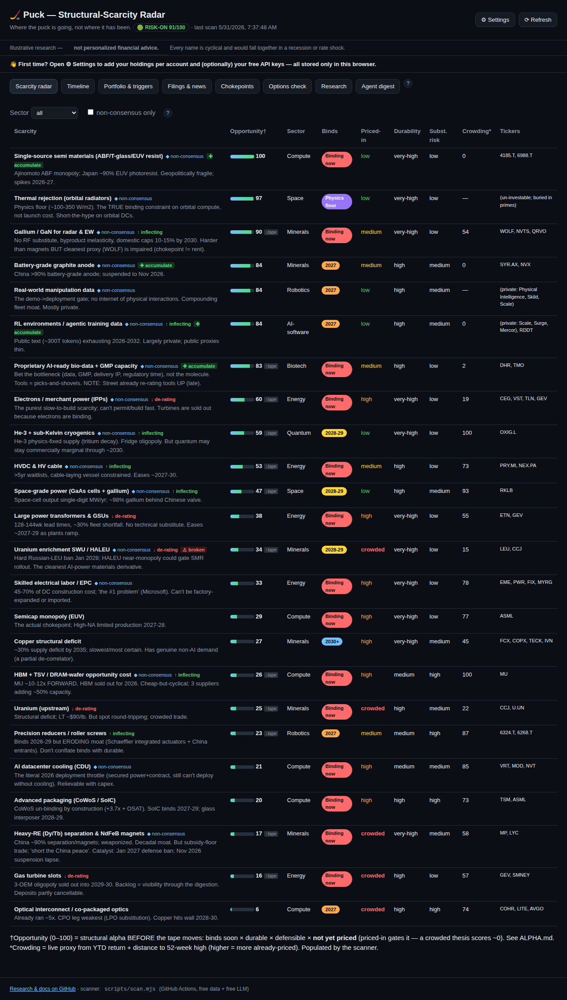
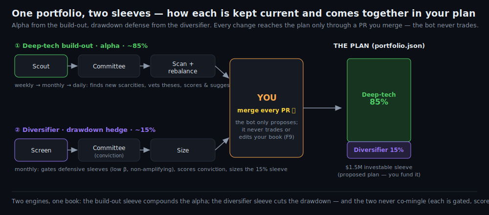
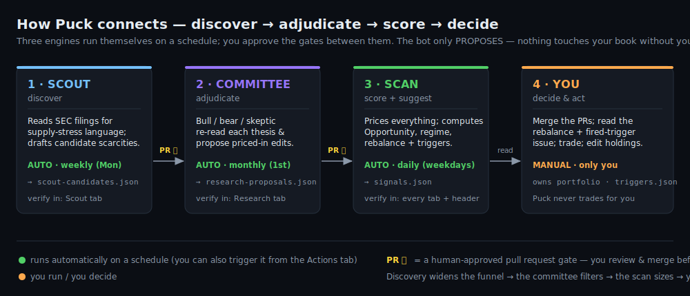
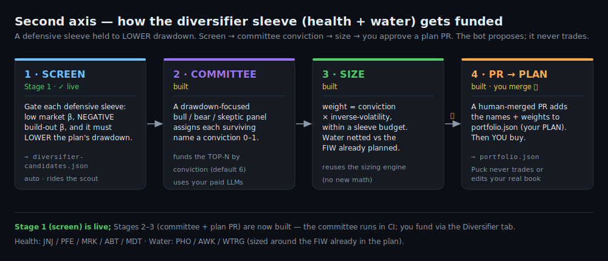
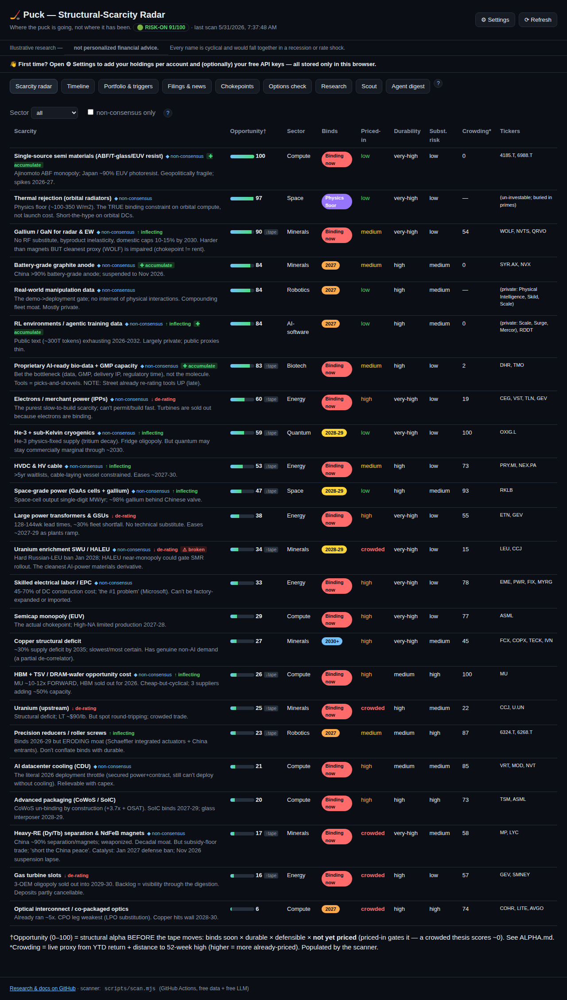
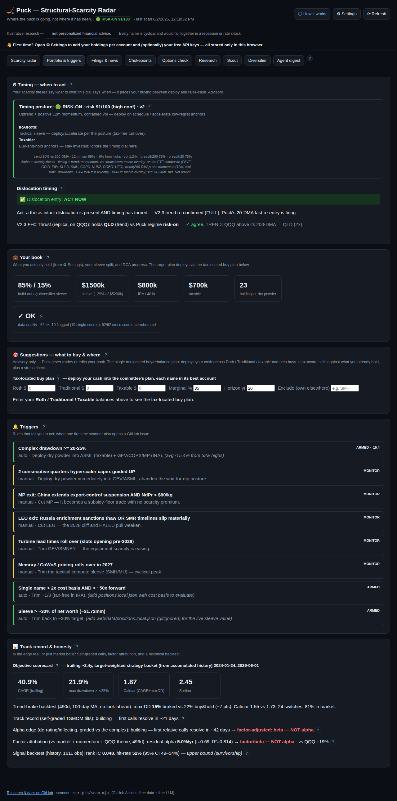
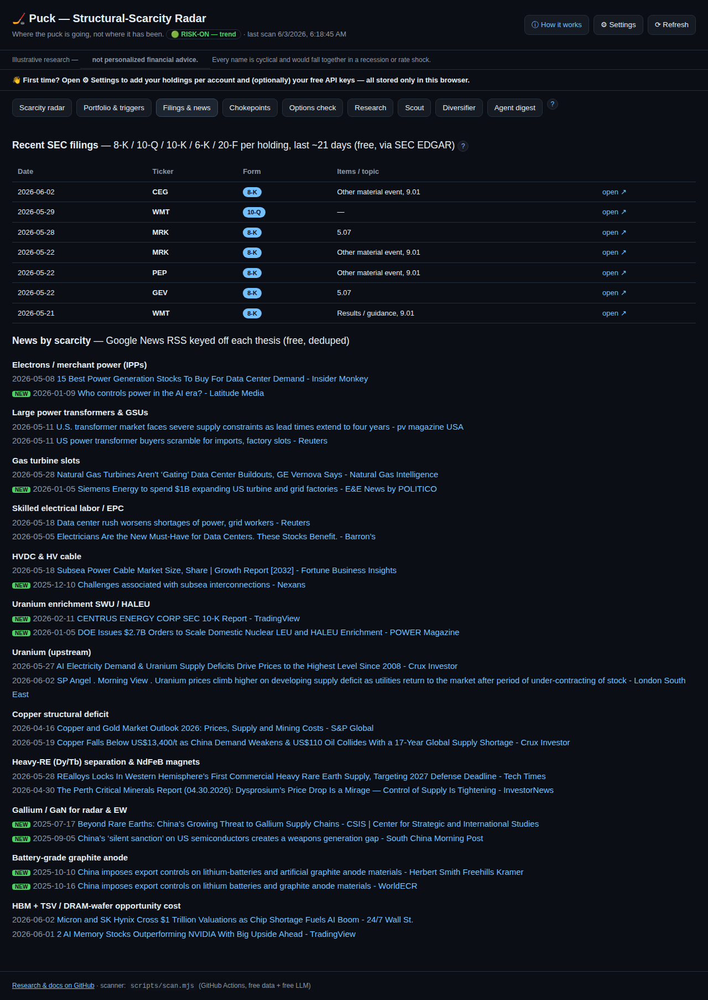
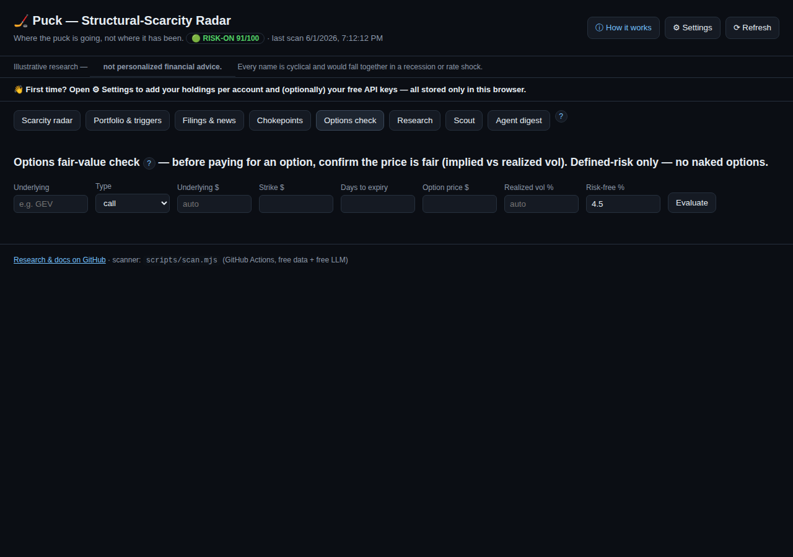
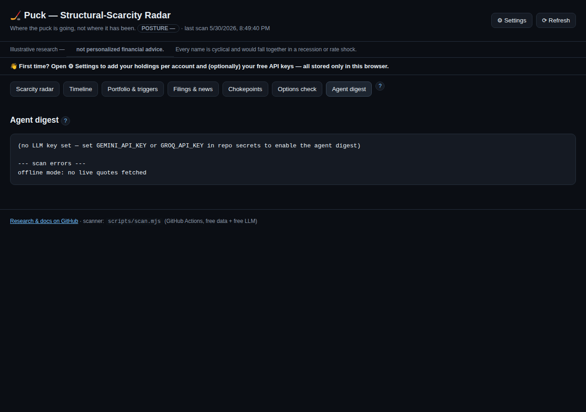
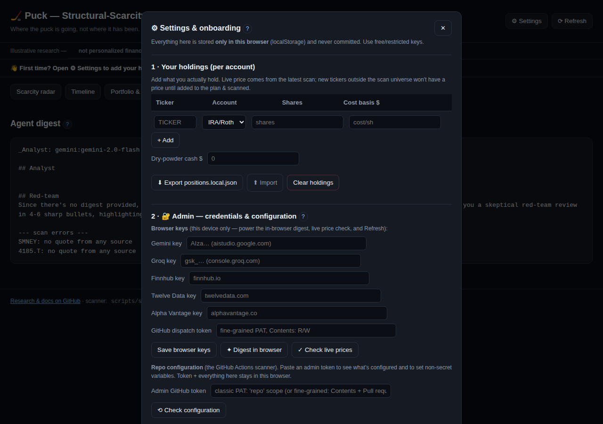

# Puck — End-User Guide

> **Not financial advice.** Puck is research tooling to inform *your own* judgment. Every name it
> tracks is cyclical and would fall together in a recession or rate shock. Prices and signals can be
> wrong or stale. Verify before you act, and consider a fiduciary advisor.

This guide explains **every feature**, **what each number means**, and **how to use it**. Screenshots
are auto-generated from the live app by the `docs` workflow, so they stay current as the app evolves.

---

## 1. What Puck is (the one-paragraph mental model)

Puck has one philosophy: **alpha from the scarcity research, timing from the tape.**
- The **alpha** is *what to own*: structural technology scarcities (chokepoints — power, grid, copper,
  uranium, rare earths, semis, etc.) that bind over 2026–2036, mapped to a real portfolio.
- The **timing** is *when to act*: a market-regime layer (trend + momentum + volatility + drawdown)
  that tells you when to deploy/go-all-in vs. when to apply the brakes and raise cash.

A free scanner runs daily on GitHub Actions, pulls free market data, computes everything, and commits
it to `web/data/signals.json`. The dashboard (hosted free on Vercel) just renders that file.

**Works on phone and desktop.** The layout is responsive — wide tables scroll horizontally and controls stack on a phone, so everything is reachable on iPhone or a large screen.

**The `?` buttons:** every section has a circular **?** help button that explains it in-app. This guide
is the long-form version.

---

## 1a. The end-to-end workflow (how it all connects)

Puck is **four engines that hand off in a loop**, with you as the only one who ever commits capital or
edits your book. Discovery widens the funnel → the committee filters it → the scan turns surviving
theses into sized suggestions → you decide. Three engines run themselves on a schedule; you approve the
gates between them.

**The whole picture — one plan, two sleeves, and where each PR lands:**

The detailed deep-tech build-out pipeline (Scout → Committee → Scan → You):

**1. Scout — *find new scarcities*.** Weekly (auto, Mon), the scout reads SEC filings for "constraint
shadow" language (downstream firms complaining about supply) and drafts **candidate** new scarcities.
It writes them to a **separate** feed (`scout-candidates.json`), never to your live list. You review
them in the **Scout** tab (§4d) and click **Accept → opens a PR**. *Merging that PR* is what adds the
scarcity to `scarcities.json`.

**2. Committee — *pressure-test the theses*.** Monthly (auto, the 1st) — and automatically whenever
`scarcities.json` changes — a synthetic **bull / bear / skeptic** committee re-reads every scarcity and
proposes edits to its read (priced-in, durability, confidence). It writes **proposals only**
(`research-proposals.json`); you review the before→after diffs in the **Research** tab (§4c) and
**Accept → PR**. Merging applies the edits.

**3. Scan — *score everything + suggest a rebalance*.** Daily (auto, weekdays after the US open), the
scanner reads your **merged** `scarcities.json` + `portfolio.json` + `triggers.json`, pulls free
prices, and computes the whole dashboard into `signals.json`: Opportunity scores, crowding, the
regime/timing posture, **rebalance suggestions** (§4.9), and **trigger status**. If a trigger fires it
**opens a GitHub issue**. It writes only generated files — *never* your portfolio or triggers.

**4. You — *decide and act*.** You own `portfolio.json` and `triggers.json`. Your jobs: **merge** the
scout/research PRs, read the **rebalance suggestion** and any **fired-trigger issue**, then place trades
yourself and update your holdings (via **⚙ Settings** in the browser, or by committing `portfolio.json`).
**Puck never trades and never edits your book.**

> **Where a NEW *axis* comes from (e.g. the Health + Climate diversifier sleeve).** Adding a whole new
> sleeve runs through the **diversifier** workflow (Actions → *diversifier*, monthly + manual): it screens
> candidate defensive baskets **book-aware** (the pipeline below), scores conviction, and proposes a sized
> sleeve for your PR approval. That's how the second (diversifier) axis is built. Diversifiers live in
> `scarcities.json` tagged `axis: "diversifier"` and are **tracked/priced but held out of the deep-tech build-out
> ranking and sizing** — they earn their place by lowering drawdown, shown with a `◇ diversifier · 2nd
> axis` badge on the radar.

#### How a diversifier sleeve gets funded (the second-axis pipeline)

Because a diversifier earns its place by *lowering drawdown* (not by binding soon), it has its own funding
pipeline, distinct from the deep-tech build-out Opportunity logic:

1. **Screen** — every candidate defensive sleeve is gated on low market β, a **near-zero or negative (≤ 0.3 tolerance)
   deep-tech build-out β** (it must not amplify the build-out), and — crucially — whether it **lowers the drawdown of
   the plan you already hold** (a sleeve that duplicates planned exposure, e.g. water vs the FIW already in
   the plan, is flagged as redundant). Output → `diversifier-candidates.json`.
2. **Committee** — a drawdown-focused bull/bear/skeptic panel assigns each surviving name a
   **conviction** 0–1 (runs in CI with an LLM key; offline it falls back to equal conviction). The sleeve
   then funds the **top N by conviction** (default 6) — a focused set, not dozens of dust positions.
3. **Size** — `weight = conviction × inverse-volatility`, within a **sleeve budget** (the
   diversifier axis as a set % of the plan, default 15%), with water netted against the FIW already planned.
4. **Fund it (PR → plan)** — the **Diversifier** tab shows the proposal; **Accept** opens a human-merged
   PR that adds the names + weights to `portfolio.json` (your *plan*) and scales the build-out so the plan
   still sums to 100%. You merge it; you then place the trades. **Puck never trades or edits your book.**

*Status: all four steps are built — the screen + workflow, the committee (CI), the sizing, and the
Diversifier tab's Accept→PR. The daily rebalance also holds the sleeve to its budget (per-axis).*

### What auto-runs vs. what you run

| Engine | Workflow | Auto cadence | Run it yourself | Output file | See it ran (UI) |
|---|---|---|---|---|---|
| **Scout** | `scout` | Mondays 07:00 UTC | Actions → *scout* → Run workflow | `scout-candidates.json` | **Scout** tab — "last sweep ⟨date⟩" + new rows |
| **Committee** | `research` | 1st of month 09:00 UTC *(and on any `scarcities.json` change)* | Actions → *research* → Run workflow | `research-proposals.json` | **Research** tab — "last run ⟨date⟩" + diffs |
| **Scan** | `scan` | Weekdays 13:00 UTC | Actions → *scan* → Run workflow, **or ⟳ Refresh** in the UI (§9) | `signals.json` (+ history/forecasts/dca) | Header — "· last scan ⟨time⟩"; updates **every** tab |
| **Diversifier** | `diversifier` | 1st of month 08:00 UTC | Actions → *diversifier* → Run workflow | `diversifier-candidates.json` | **Diversifier** tab — review + Accept→PR |

**Things only you can do (human-in-the-loop gates):** merge the scout/research PRs; edit
`portfolio.json` + `triggers.json`; act on rebalance suggestions and fired-trigger issues. Everything
else happens on the cron schedule with no action from you.

### How to confirm a run actually happened

- **Scan:** the header reads **"· last scan ⟨timestamp⟩"**; if it's >3 days old you get a **⚠ Stale data**
  banner. In GitHub you'll see a green **scan** run in *Actions* and a `scan: refresh signals` commit on `main`.
- **Scout:** the **Scout** tab lists candidates with **"last sweep ⟨date⟩"**; commit `scout output ⟨date⟩`.
- **Committee:** the **Research** tab shows proposals with **"last run ⟨date⟩"**; commit `auto-research proposals ⟨date⟩`.
- **A trigger fired:** a **GitHub Issue** titled *"Scarcity trigger fired"* appears, and the trigger shows
  `fired` in **Portfolio & triggers → Triggers** (§4.3).

---

## 2. Getting started (first 5 minutes)

1. **Open the dashboard** (your Vercel URL). You'll land on the **Scarcity radar**.
2. A **"First time?"** banner points you to **⚙ Settings** — open it.
3. **Add your holdings** per account (see §8). This is stored *only in your browser* — never uploaded.
4. *(Optional)* add **free API keys** (§8.2–8.3) to enable the AI digest and extra data cross-checks.
5. Use the tabs across the top to explore. Tap any **?** for context.

Nothing you enter in Settings is ever committed to the repo — it lives in your browser's localStorage.

---

## 3. Scarcity radar (the alpha)

Each row is a structural scarcity, **ranked by Opportunity Score — where the retail alpha is.**
**How to read the columns:**

| Column | Meaning | How to use it |
|---|---|---|
| **Scarcity** | The chokepoint + a one-line thesis. `◆ non-consensus` = under-appreciated. `▲ drift` = its priced-in level has changed since first tracked. | Hunt for non-consensus + low priced-in. |
| **Opportunity†** | **0–100 structural-alpha score** = *binds soon × durable × defensible × **not yet priced***. Priced-in is a multiplicative **gate**: a `crowded` thesis scores ~0 however good the business, because there's no alpha left in what's priced. The gate blends the **human label (60%)** with a **live price-derived crowding proxy (40%)**, so it tracks the tape; a **↑tape / ↓tape** chip flags where the market disagrees with the label. Built from the source fields only — no curve-fitting. | **Top of the list = the best structural setups.** Top scores are graded as relative-outperformance forecasts. |
| **Binds** | When it starts biting: `now → 2027 → 2028-29 → 2030+ → physics floor`. | Earlier = more urgent. |
| **Priced-in** | How much the market already reflects it: `low → medium → high → crowded`. | High/crowded = less edge left; low = more opportunity. |
| **Durability** | How long the moat lasts (`low → very-high`). | Favor very-high. |
| **Subst. risk** | Chance a substitute relieves the scarcity. | Lower is better. |
| **Crowding\*** | A **live 0–100** proxy from price action (YTD + distance to 52-week high). | Higher = more already-priced by the market *right now*. |
| **Tickers** | Investable proxies (some scarcities are private/foreign — no clean ticker). | — |

Each scarcity may also carry an **alpha flag**: **↓ de-rating** (a crowded thesis losing relative strength vs the deep-tech build-out complex → reduce) or **↑ inflecting** (an under-priced thesis gaining → accumulate). This operationalizes the thesis's core claim and is graded by the Track record over time.

It may also carry a **forced-flow flag** (ALPHA.md Edge 3 — buying what others are *forced* to sell):
**✚ accumulate** = the name is mechanically de-rated (off highs, below trend, falling) *while its
structural thesis is intact* — the footprint of forced/neglect selling. This flag is **regime-aware**:
when the timing dial has the brakes on it shows **⏳ accumulate on trigger** — a *deploy-when-the-
drawdown-trigger-fires* priority, **not** a buy-now call — so selection (what) and timing (when) never
contradict. **⚠ broken** = de-rated *and* the thesis is weak → real deterioration, not an opportunity.

> **Where does the alpha actually come from?** See **`ALPHA.md`** — the research foundation. In short, a
> retail investor can only beat the market where a *structural constraint* stops institutions from
> doing so: **(1) time-horizon arbitrage** (you can wait 10 years; a quarterly-judged PM can't),
> **(2) complexity/inaccessibility** (private/foreign/impaired chokepoints with no clean ETF — the
> chokepoints tab), **(3) forced-flow/neglect** (buying what others are *forced* to sell), and
> **(4) behavioral discipline**. The Opportunity Score operationalizes #1; the rest are tracked in their
> own panels. Everything is graded — an ungraded edge is just a story.

**Controls:** filter by **Sector**, or tick **non-consensus only** to see just the under-appreciated
theses. The durable edge is **low priced-in + high durability + low substitution risk**.

---

## 4. Portfolio & triggers

This tab is organized into five labelled blocks, each with its own **?** help:

1. **⏱ Timing** — when to act (the regime posture + the dislocation cross-check). §4.1, §4.1a
2. **💼 Your book** — your live holdings vs the target plan, summary cards, DCA progress, and the holdings table. §4.2, §4.4, §4.5, §4.6
3. **🎯 Suggestions — what to buy & where** — a **single tax-located buy/rebalance plan** that deploys your cash across Roth / Traditional / taxable (the old standalone Holdings-plan and generic Rebalance-plan tables were folded into this one), plus a stress check. **Advisory only — Puck never trades.** §4.7, §4.10
4. **🔔 Triggers** — rules that tell you to act. §4.3
5. **📊 Track record & honesty** — is the edge real? Scorecard, factor attribution, signal backtest. §4.1b–§4.1e

### 4.1 Timing posture (the regime)
The colored banner at the top is the **timing posture** — the heart of "when to act":

| Posture | Meaning | What to do |
|---|---|---|
| 🟢 **risk-on** (score ≥70) | Uptrend + positive 12-month momentum, contained volatility | Deploy on schedule / accelerate low-regret anchors |
| ⚪ **neutral** (45–69) | Mixed | Stick to the DCA calendar; no acceleration |
| 🟠 **caution** (25–44) | Trend/vol deteriorating | Tap the brakes — slow deploys, build dry powder |
| 🔴 **defensive** (<25) | Downtrend, drawdown, rising vol | Favor cash; deploy only into the drawdown trigger |

It's a **risk dial that paces your DCA**, not an all-in/all-out switch. It's built on *independent,
replicated* research (Faber 200-DMA trend; Moskowitz-Ooi-Pedersen time-series momentum; Moreira-Muir
volatility; Hurst-Ooi-Pedersen trend) — **not** a curve-fit backtest. Full detail: `REGIME.md`. The posture shows a **confidence** label (low/medium/high) and warns when the score sits near a band edge — it's a coarse dial, not a precise number.

**v2 refinements:** the score is computed on the **theme ETFs** (a cleaner composite than averaging 19
noisy single names); it's **account-aware** — the posture drives your **IRA/Roth** sleeve (tactical,
tax-free turnover) while **taxable** stays buy-and-hold anchors (shown under the posture); and it carries
a **per-name TSMOM tilt** (which names to lean into vs. trim).

**Two overlays (Timing v2):**
- **Macro-stress brake (exit-only).** Forces *defensive* only when **two leading risk signals fire
  together** — the **VIX term-structure inverts** (front VIX ≥ VIX3M) **AND high-yield credit widens
  fast** (HYG ~1-month return ≤ −3%). Requiring both makes false alarms rare; being exit-only means it
  can only de-risk, never add. When it's on, the posture note shows **MACRO-STRESS**.
- **20-DMA fast re-entry.** When ≥60% of holdings reclaim their 20-day average, the posture **re-risks
  one notch** — so you don't stay in cash too long after a V-shaped bottom (the momentum-crash fix). The
  macro brake always wins over re-entry.

### 4.1a Dislocation timing + V2.3 cross-check
Just under the posture, the **Dislocation timing** card answers a single question: *when should I take
advantage of a dislocation?* A dislocation is a name mechanically sold off (off highs, below trend)
**while its structural thesis is intact** (the forced-flow **✚ accumulate** flag). The danger is buying
one while it's still falling — a falling knife. So the verdict is:

- **✅ ACT NOW** — a thesis-intact dislocation exists **and** timing has turned: the **drawdown trigger**
  fired, the **V2.3-style trend re-confirmed** (FULL on QQQ), or the **20-DMA fast re-entry** is firing.
- **⏳ WAIT** — the dislocation is real but timing is still defensive; wait for the turn.
- **— none** — nothing dislocated into an intact thesis right now.

The **V2.3 cross-check** is a **faithful replica** of your F+C Thrust rule, recomputed on **QQQ**, and
shows which instrument it holds (**QLD** 2× or **SGOV**) next to Puck's regime posture — **✓ agree** =
confirmation, **⚠ diverge** = look closer. The exact ladder (first match wins):

1. **CRASH_OFF** (trailing 252-day return < 0 **AND** 60-day annualized vol > 25%) → **SGOV**
2. else **TREND** (close > 200-DMA) → **QLD**
3. else **THRUST** (close > 20-DMA **AND** the 20-DMA is higher than 10 trading days ago) → **QLD**
4. else → **SGOV**

…with an **exit-only composite-stress overlay**: if the ladder picked QLD **and** VIX/VIX3M ≥ 1.0 for 3
consecutive days **and** HY-velocity (20-day change in −log(HYG)) sits in the top 5% of its trailing
252-day distribution, it forces **SGOV**. If any overlay input (^VIX/^VIX3M/HYG) is missing, the overlay
is suppressed (it won't act on fake data). **Puck itself adds no leverage** — a 2× QLD sleeve would
breach the −35% max-drawdown objective unless gated by a full exit to cash.

### 4.1b Objective scorecard
The app's goal is **max 10-year return with max drawdown < 35%, and the best Calmar/Sortino.** This card
measures your **strategy basket** (target-weighted holdings) over the trailing window: **CAGR**, **max
drawdown** (turns ⚠ red if it breaches −35%), **Calmar** (CAGR ÷ maxDD), and **Sortino** (return ÷
downside risk). It's a live check on whether the timing/risk layer is actually holding drawdown under the
limit while earning a good risk-adjusted return — a backward-looking proxy, not a forecast. A **trend-brake backtest** line below it shows, on this basket and with no look-ahead, whether a moving-average brake actually cut max-drawdown and improved Calmar vs. buy-and-hold (the dial's premise, tested).

### 4.1c Track record (self-grading)
Puck records every dated **per-name TSMOM tilt** (overweight → expect the stock up over ~21 days;
underweight → down) and, when the horizon matures, **resolves** it against the realized price into a
**hit-rate**. It starts empty and fills in over ~21 days. This is the accountability layer — the system
is graded on whether its calls came true, turning opinions into a verifiable, compounding record. A
hit-rate persistently below ~50% means the signal isn't working (which is what you want to know).

A second **Alpha edge** line grades the harder claim. Each **de-rating / inflecting** flag becomes a
42-day *relative* forecast — does the flagged scarcity basket actually under/out-perform the deep-tech build-out
complex (the theme ETFs)? That relative move, not raw direction, is the thesis's real edge, so it is
scored separately (de-rating and inflecting buckets). It tells you whether the alpha signal earns its keep.

### 4.1d Factor attribution — alpha or just beta? (G1, the honesty gate's teeth)
The most important sanity check in the app. A rising basket or a good hit-rate is **not** proof of skill —
the book could simply be loaded on factors anyone can buy cheaply. So Puck regresses the basket's daily
return on a small set of **tradeable factors: market (SPY), momentum (MTUM), and — crucially — a thematic
proxy (QQQ).** The regression's **intercept is the residual alpha**: the return left *after* market,
momentum, and the AI/tech theme are accounted for. **Including the theme leg is the whole point** — without
it, this single-factor deep-tech build-out book's beta would masquerade as alpha (exactly the trap an adversarial
review flagged).

The verdict reads **"genuine alpha"** only when that residual is positive **and** statistically significant
(|t| ≥ 2); otherwise **"factor/beta — not alpha,"** and the app says so plainly rather than flattering
itself. It also shows the blunt absolute check: did the basket beat simply buying **QQQ**? *Caveat:* with
limited, partly-foreign history the estimate is noisy for a while (small sample, wide error band) — early
readings are indicative, not verdicts. This is the layer that keeps the whole "alpha" claim falsifiable.

### 4.1e Signal backtest (historical, cross-sectional)
The Track record is unbiased but slow. This line evidences the same edge on **history**: across the
scarcity baskets and many past dates, does **trailing relative strength vs the deep-tech build-out complex predict the
forward relative return?** It reports the rank **IC** (predictive ordering) and a directional **hit-rate
with a 95% confidence interval** (wide at small samples — honestly so). **Important caveat:** the
basket→ticker map is *today's* — these names were partly chosen *because* they worked, so the universe
carries selection/survivorship bias and this IC is an **upper bound**, not the true edge (prices themselves
are strictly point-in-time). Read it as "has the signal logic worked on these names"; the live ledger is
the unbiased confirmation. Runs when the accumulated price warehouse is available.

### 4.2 Summary cards
Sleeve size, IRA vs taxable split, holding count, and a **data-quality** card (✓ OK or ⚠ degraded —
see §10).

### 4.3 Triggers
Rules that tell you to act. Each shows a state — **armed** (active), **monitor** (manual watch), or
**fired** (condition met). Auto triggers require **two consecutive scans** to confirm before they fire
(the first time a condition is met it shows *pending — needs a 2nd confirming scan*), so a single bad
print or one-day spike can't fire an action:
- **Drawdown** (auto): complex down ≥20–25% from highs → deploy dry powder.
- **Trim rule** (auto): a name >2× cost basis **and** >50× forward P/E → trim ⅓ (needs your cost basis
  from Settings).
- **Sleeve cap** (auto): sleeve value > ~$1.72mm → trim back (needs your holdings from Settings).
- **Policy triggers** (manual): e.g. rare-earth/uranium policy shifts.

When a trigger fires, the scanner opens a GitHub issue (deduped — one open issue at a time). You can
also get an **email** the moment a trigger *newly* fires (a state change, not every run) — turn it on in
**Settings → Admin** (set the alert email variable) plus the SMTP secrets in `SETUP.md` §3c. **Auto
triggers are held on a degraded-data run** so bad data can't fire an action (§10).

### 4.4 Holdings table → folded into the buy plan
The standalone Holdings-plan table was **removed** to keep the Portfolio page to one actionable plan. The
target plan's names/weights now flow directly into the **Tax-located buy plan** (§4.10), which shows what
to buy of each and in which account. **Tiers** (deployment pace) still drive the DCA calendar (§4.6):
A = 100% now · B = 50% now + months 1–3 · C = 25% now + DCA to month 9 · D = small option sleeve · DRY = cash.

### 4.5 Your holdings (live)
Once you add positions in Settings, this panel shows **market value, gain vs cost, % of target,
per-account subtotals, and your sleeve value vs the cap** — computed from your browser-stored positions
× the latest scan prices. The **Rebalance** column flags any holding whose actual weight has drifted
**>±25% from its target weight** (⚖ *trim* if overweight, *add* if underweight). Foreign-currency lots
are **FX-converted to USD** for the sleeve total (a lot with no available FX rate is excluded and noted).

---

### 4.6 DCA progress
Once you've entered positions, this shows how much of each holding's **target** you've **deployed**
(shares × cost basis) against the 9-month dollar-cost-averaging calendar — a progress bar + % per
holding, and the sleeve total deployed. Use it to stay on the plan and see where dry powder still goes.

## 4b. Chokepoints (inaccessible / differentiated alpha)
The sharpest thesis idea: **the best chokepoints have no clean ETF** — they're private (SpaceX, Physical
Intelligence), foreign (ASML, Ajinomoto, Harmonic Drive), or impaired. The app **discovers the public
proxies** exposed to each by searching **SEC filings** for who mentions the entity (customers/suppliers/
partners). They're ranked by **specificity** (a TF-IDF score, 0–1) rather than raw mention count: a
diversified megacap that mentions everything once in boilerplate — and shows up across many chokepoints —
is a *weak* proxy, so it's dimmed and flagged **⚠ generic**, while a concentrated pure-play is surfaced
first. The app also shows a **heat** (attention + proxy momentum) and the proxies' relative strength vs
the deep-tech build-out complex. A **🕸 Cross-chokepoint hubs** panel maps *second-order* exposure: public names
that appear across **multiple** bottlenecks (×degree) — a **hub** (≥3) is a diversified
"picks-and-shovels" way to play the whole complex, a degree-1 name is a concentrated pure play. All
data-derived (no hand-picked lists); discovered names are research leads, not recommendations.

### 4.7 Stress test
Applies the thesis's named shocks to **your** sleeve and shows the drawdown vs the **−35% objective
limit**: 2027–28 deep-tech build-out digestion, a 2022-style rate shock, a broad recession, and a China
rare-earth "peace." Coarse, documented high-beta shock vectors (not fitted) — a feel for tail risk.
Runs entirely in your browser on your stored positions.

### 4.8 Suggested IRA tilts → merged into the Rebalance plan
The standalone "Suggested IRA tilts" table was **removed**: the Rebalance plan's *signal* column (§4.9)
already applies the same per-name **TSMOM × regime** tilt to the IRA sleeve, so it now lives in one place
rather than two overlapping ones.

### 4.9 Rebalance plan → folded into the tax-located plan
The standalone Rebalance-plan table was **removed** — the single **Tax-located buy plan** (§4.10) is now the
one buy/rebalance view. The scanner still computes the underlying weight/funding engine (below) and emits it
to `signals.json` for the record; the dashboard just no longer renders it as a separate table.

*(Engine, for reference — how the target weights are derived:)* it builds **two** target-weight vectors and turns each into a concrete
**buy/sell dollar plan**, shown side by side so you can see how the signals move your book:
- **Research plan** — your `portfolio.json` weights nudged only by a **light ±15% inverse-volatility
  tilt**, so high-vol names (COPX/LEU/MP) don't silently dominate. Your conviction stays primary.
- **Signal plan** — the research weight **also** moved by the **thesis Opportunity** (the human
  priced-in label × durability, *not* the price-momentum part — momentum enters only once, via the regime
  tilt) and the **regime tilt**. A research-committee "crowded" downgrade lowers a name's thesis
  Opportunity → shrinks its weight here → surfaces a trim. This **closes the thesis→allocation link**.

**Grouped by sleeve.** The buy/sell rows are split into **Deep-tech build-out** and **◇ Diversifier · 2nd
axis** sub-sections, each rebalanced *within its own budget* — so the diversifier sleeve is held to its
target % and never drifts into the build-out under the inverse-vol/opportunity tilts (and the opportunity
tilt is never applied to the diversifier). The diversifier line reads "no moves this scan" or "not funded
yet" when it has nothing to change.

**Funding rules (so the plan is realistic, not just ideal weights):**
- The **IRA** (tax-free) **self-funds** — trims pay for buys within the sleeve (buys ≈ sells exactly).
- The **taxable** sleeve stays **buy-and-hold anchors**: a taxable **trim is only actioned above a higher
  bar — the cost-basis trim rule** (>2× cost AND >50× forward). A signal-driven taxable sell is *never*
  automated (selling into a dislocation can invert the forced-flow edge and realizes tax) — it needs your
  decision. Otherwise the ideal weight is shown but held, reported as `anchor-trim held`.
- **`needs new cash`** — when buys in a sleeve exceed its available sells + dry powder, the shortfall is
  surfaced explicitly rather than implying free money.

**Honest scope + accountability.** This is a **volatility** tilt, *not* correlation/covariance-aware —
on a ~1.0-correlated book a standalone-vol tilt does little for portfolio drawdown, so true equal-risk
sizing waits on a genuinely uncorrelated 2nd axis (G2). The tilt is also **graded**: each scan records a
falsifiable *"signal weights beat the research baseline"* claim into the Track record and resolves it at
~42 days — the header shows **"ungraded (recording…)"** until the first resolves, then the live hit-rate.
With a `positions.local.json` it rebalances **what you actually hold**; without it, it shows the ideal
weighting vs your static plan. **Advisory only** — it never edits your portfolio or places trades. Not advice.

### 4.10 Tax-located buy plan (Roth / Traditional / taxable)
Inside **🎯 Suggestions** — the **single** buy/rebalance view (the old Holdings-plan and Rebalance-plan
tables fold into this one). It takes the committee's suggested holdings (build-out + the diversifier
sleeve), spreads your cash across the target weights, and **places each name in the account that maximizes
after-tax terminal value** — shown as a **buy list grouped by account**. Each name's dollars can **split
across accounts** so capacity is filled exactly (no account is over/under-filled).

**As you accept PRs:** the plan always reads your live `portfolio.json`, so any portfolio-changing PR
re-reviews it. While the diversifier funding PR is *pending* it previews the funded target; once you
**merge** it, those names are in `portfolio.json` and the plan uses it as-is (it won't double-count). The
build-out's plan, by contrast, is changed by editing `portfolio.json` — research/scout PRs edit the
*research* (`scarcities.json`), not your holdings. *(Today it deploys from cash; netting buy/sell deltas
against positions you already hold is the next step.)*

Two robust rules: **(1)** shelter the annual **dividend tax drag** — income-heavy names → a tax-advantaged
account; tax-efficient (low-yield) names → **taxable** (qualified rates, step-up at death, loss-harvesting);
**(2)** within tax-advantaged, **highest-growth → Roth** (the biggest balance compounds tax-free), income/
lower-growth → **Traditional**.

Inline inputs (browser-stored; defaults 35% / 20yr) — so you never tell anyone your tax rate ahead of time:
- **Roth $ / Traditional $ / Taxable $** — your cash in each account (the deployable capacity).
- **Marginal % · Horizon yr** — drive the tax-drag estimate.
- **Exclude (own elsewhere)** — tickers you already hold in your broader portfolio (e.g. `SMH`); they're
  dropped and the remaining weights renormalized.

Each account block shows what to **buy** there, the $ amount, yield, and the dividend tax it shelters/yr;
the header reports drag avoided per year + compounded over your horizon. **Rebalancing later keeps these
locations.** Until you split Roth vs Traditional it runs a 2-way (tax-advantaged vs taxable) split and says so.

**Advisory, not tax advice.** It's the robust *location* lever; it does **not** model your exact bracket
arbitrage (withdrawal vs contribution rate), RMDs, or estate plan. Inputs live only in your browser.

## 4c. Research (LLM proposals you approve)
The **Research** tab surfaces the monthly research engine's proposed reassessments. The engine runs the
free LLMs (deep-dive → cross-model red-team → synthesis) over **deep evidence** — multi-angle news
*article excerpts* + *SEC filing passages* + the live de-rating / forced-flow / opportunity signals —
and proposes updates to each scarcity's **priced-in / bind-window / non-consensus** fields only.

Each card shows the **before→after** change, the LLM's rationale, its sources, and confidence:
- **✓ Accept → open PR** opens a GitHub pull request containing *just that one change* to
  `scarcities.json`, which you then merge. Needs a token in **Settings → Admin** with write access —
  a **classic** token with the **`repo`** scope, or a **fine-grained** token with **Contents** and
  **Pull requests** both read/write. (A 404/403 on a public repo means the token can read but not
  write — usually the classic `repo` scope wasn't ticked.)
- **✕ Reject** dismisses it.

The bot only *proposes*; **you approve**, and it can **only ever** touch those three fields — never the
thesis or tickers (the F9 ownership rule, enforced in the browser *and* the scanner). Not advice.

## 4d. Scout (finding NEW scarcities)
The Research tab re-scores the *known* scarcities; the **Scout** tab hunts for *new* ones — the
alpha-generation frontier. It is deliberately **not** a trend-finder: by the time something reads as a
trend it's already priced, and **ALPHA.md** is explicit that there's no edge in what's priced. Instead
the scout looks for the **fingerprint of a binding constraint before anyone names it.**

**How it works (constraint-shadow):** a real shortage shows up first as downstream companies
*complaining* in their SEC filings — *"lead times extended", "unable to secure allocation", "qualified a
second source"*. The scout searches that complaint language across all filers, **clusters which companies
are under broad supply stress** (a filer griping under many distinct constraint phrases is a strong
lead), and infers the candidate chokepoint from the *pattern of who's complaining* — not from a headline.
Filers already explained by a known scarcity are dropped (novelty filter); candidates already discussed
widely in financial media are down-weighted (the edge is being early, not loud).

**The same committee vets it — fully.** Each lead is synthesized into a draft scarcity and run through
the identical pipeline that scores the known 24: **Bull / Bear / Skeptic → CIO**, then the **deterministic
verification gate** (thin-evidence / ticker-sanity checks) and the **CRO risk review** (which catches
hallucinated or misattributed tickers — important, since the scout's tickers come from fuzzy filing
discovery). So you only ever review *adversarially-vetted* candidates, never raw noise. Each card also
carries a **legibility tag** — 🟢 *early/contrarian* (little mainstream coverage; where the edge is) vs
🟡 *already-legible* (heavily covered, likely already priced) — and legible candidates are down-weighted.

Each card shows the inferred scarcity, the **filer that flagged it** + the constraint phrases that fired,
the proposed fields, and the committee's confidence:
- **✓ Accept → open PR (add scarcity)** opens a pull request that *adds* the new scarcity to
  `scarcities.json`, which you merge. Same token requirement as the Research tab.
- **✕ Reject** dismisses it.

The scout runs **weekly** and never edits the watchlist itself — it only proposes; **you approve**
admission (F9). Not advice; every candidate is a lead to investigate, and most should fail the committee.

**Constraint phrases (what the scout searches for).** The search phrases are themselves
**LLM-generated and human-vetted**: run the scout workflow in `generate-phrases` mode and the frontier
model proposes candidate complaint phrases, which land **pending** on this tab. A generated phrase is
**never searched until you approve it** — click **✓ Approve pending phrases → open PR** to vet them
(it opens a PR updating `scout-phrases.json`; after merge the weekly sweep searches them). Until any are
approved, the scout falls back to a built-in seed list, so it always works.

## 5. Filings & news

Free, keyless catalysts:
- **SEC EDGAR filings** per holding (8-K/10-Q/10-K/6-K/20-F, last ~21 days). 8-K **items** are decoded
  into plain topics (e.g. *Results/guidance*, *Material agreement*). A green **NEW** badge = unseen
  since the last scan. Click **open ↗** to read the filing on SEC.gov.
- **News by scarcity**: Google-News headlines keyed to each scarcity's thesis terms, deduped, grouped by
  scarcity. **NEW** badges mark fresh items.

Both feed the Agent digest. Use this tab to spot *catalysts* — backlog, capacity, guidance, pricing,
policy — that move a thesis.

---

## 6. Options check (fair-value before you buy)

Before paying for an option, confirm the **price is fair**. Puck backs out the option's **implied
volatility (IV)** from its market price (Black-Scholes) and compares it to the underlying's recent
**realized volatility** (from the scan).

**How to use it:**
1. Type the **underlying** ticker — its price and realized vol auto-fill from the latest scan.
2. Choose **call/put**, enter **strike**, **days to expiry**, and the **option price** (premium).
3. Click **Evaluate**.

**What you get:** IV, realized vol, **IV ÷ realized**, the **fair value at realized vol**, the **edge
vs fair**, a **verdict**, and the greeks (delta/vega/theta). When the scan has it, the result also shows
the underlying's **market ATM implied vol** (from the free Yahoo options chain) next to your option's IV —
a quick check of whether your contract is priced rich/cheap vs the at-the-money market.

| Verdict | Meaning |
|---|---|
| **cheap** | IV below realized vol |
| **fair** | IV within a normal variance-risk premium (~0.95–1.35× realized) |
| **rich** | IV well above realized — you're paying up for premium |

It also suggests a **defined-risk structure** based on the live posture (defensive → put / put-spread;
risk-on → LEAPS call).

> **Defined-risk only — no naked options** (both accounts). Use long calls/puts, debit spreads, collars,
> covered calls, cash-secured puts. Caveat: realized vol is backward-looking and options carry
> event/skew premia, so treat this as a **sanity check, not a price oracle.** Not advice.

---

## 7. Agent digest

An optional **"analyst + red-team"** read of what materially changed this scan for the **deep-tech
build-out** sleeve (quotes incl. forward P/E, SEC filings, news, regime) and whether any trigger looks
closer. With **two** keys it runs **cross-model** — the analyst on one model, the red-team on another —
so it isn't a model grading itself. It works with your **free or paid** models, and the diversifier
sleeve isn't summarized here (it's judged on drawdown reduction, not narrative).

It uses the **latest free thinking models** by default — Gemini 3.5 Flash and Groq's gpt-oss-120b — so
the analysis actually reasons rather than pattern-matches. Both are overridable via the `GEMINI_MODEL`
/ `GROQ_MODEL` repo variables when newer models ship, so a model retirement needs no code change. If a
model is unreachable (retired/blocked/rate-limited) the run now says so **loudly** in its report
instead of silently producing nothing.

- **Automated:** set `GEMINI_API_KEY` (and optionally `GROQ_API_KEY`) as GitHub repo secrets; the daily
  scan writes the digest.
- **In-browser, on demand:** add a Gemini key in Settings and click **✦ Generate digest in browser**.

---

## 8. ⚙ Settings & onboarding

Everything here is stored **only in this browser** (localStorage) and **never committed**.

### 8.1 Your holdings (per account)
Add each holding: **ticker, account (IRA/Roth or Taxable), shares, cost basis**, plus your **dry-powder
cash**. Live prices come from the latest scan.
- **⬇ Export positions.local.json** — download your positions in the exact shape the scanner reads, so
  the *server-side* trim rule and sleeve-cap can compute against your real lots. (Drop the file into
  `web/data/` — it's gitignored, so it's never committed.)
- **⬆ Import** — load a positions file back in.
- **Clear holdings** — wipe them from this browser.

### 8.2 🔐 Admin — credentials & configuration
One place for every credential, in two tiers:

**Browser keys** (stored only in this browser; power client-side features):
- **Gemini** (aistudio.google.com) — in-browser digest. **Groq** (console.groq.com) — second red-team model.
- **Finnhub / Twelve Data / Alpha Vantage** — data cross-checks; Finnhub also powers **✓ Check live prices**.
- **GitHub dispatch token** (Contents: R/W) — lets **⟳ Refresh** trigger a live scan (§9).
- Click **Save browser keys**.

**Repo configuration + research review** (what the automated scanner uses, and what approves research
proposals). Paste an **admin GitHub token** — a **classic** token with the **`repo`** scope, or a
**fine-grained** token with *Contents + Pull requests* (read/write, for accepting proposals on the
Research tab) plus *Secrets: read* and *Variables: read/write* (for the config check). Click
**⟲ Check configuration** to get a ✅/⬜ status for
**every** secret and variable the scanner can use (LLM keys, data keys, `SMTP_USER`/`SMTP_PASS`,
`ALERT_EMAIL_TO`, `SEC_USER_AGENT`).
- **Variables** (alert email, SEC user-agent) are non-secret — set them **right here** with **Save
  variables to GitHub**.
- **Secrets** (API keys, SMTP password) are *write-only* in GitHub for security and can't be set from a
  static page — the panel shows whether each is configured and links to GitHub's secrets form to
  set/rotate them. Email setup details: `SETUP.md` §3c.

**Optional: price-history database (Supabase).** The app persists daily price history to a Postgres
database so backtests, the objective metrics, and the V2.3 cross-check can use a growing record
instead of re-fetching 1–2 years from Yahoo each run. To enable it:
1. Create a free **Supabase** project; in the SQL Editor, run **`db/schema.sql`** (creates the
   `price_history` table with row-level security on).
2. In **Admin**, set **SUPABASE_URL** (your project URL) and **Save variables to GitHub**.
3. In GitHub repo **Settings → Secrets**, add **SUPABASE_SERVICE_KEY** = your project's *service_role*
   key (it's a secret, so it can't be set from this page).

That's it — the daily scanner starts accumulating history. The **service_role key is used only by the
scanner (server-side)**; the dashboard never touches the database, and **nothing breaks if you skip
this** (history persistence is simply disabled). For a one-time deep backfill, run the scan workflow
with the `--backfill` argument (fetches each ticker's full available history once).

Everything you paste here stays in this browser.

---

## 9. ⟳ Refresh (on-demand scan)

The scanner runs automatically on weekdays. To refresh **now**, click **⟳ Refresh**:
- The first time, paste your **dispatch token** (stored only in your browser).
- It triggers the GitHub Action; the dashboard **auto-polls and live-reloads** when fresh data lands
  (~1–3 min). No manual reload.
- No token? Refresh points you to the manual **Actions → scan → Run workflow**.

---

## 10. Data integrity & quality (why you can trust the numbers)

Puck guards against bad/synthetic data:
- **HTTPS-only** sources; **plausibility** checks (no ≤0 / non-finite prices).
- **Cross-source corroboration** — Yahoo + Stooq (+ any free keys) are compared; a **>3% divergence**
  flags the quote (**⚠**).
- **Anomaly vs last scan** — a **>35%** jump (likely a bad print / unadjusted split) is flagged.
- **Freshness** — a stale/halted last bar is flagged.
- **Fail-safe triggers** — on a **degraded** run (too many errors/flags) the auto-triggers are **held**,
  so bad data can't fire an action. The **data-quality card** on the Portfolio tab shows ✓ OK or
  ⚠ degraded.

- **Cross-source consensus** — when sources disagree, the published price is the **consensus that
  excludes the outlier** (a lone bad/synthetic print is dropped, not just flagged), and foreign lots are
  never silently summed as USD.
- **XSS-safe** — all third-party text (news headlines, filing fields) is HTML-escaped and links are
  restricted to `http(s)` before display, so a poisoned feed can't run code in your browser.

Add free market-data keys (§8.3) for stronger corroboration.

---

## 11. Glossary

- **Scarcity / chokepoint** — an input that's slow/impossible to expand, so demand outruns supply.
- **Priced-in / crowding** — how much the market already reflects a thesis (judgment vs. live price proxy).
- **Bind window** — when a scarcity starts constraining.
- **Tier** — how fast a holding is deployed (A/B/C/D/DRY).
- **200-DMA** — 200-day moving average; price above it = healthier trend (Faber).
- **12-month momentum** — trailing one-year return; the time-series-momentum signal (MOP 2012).
- **Realized vol** — actual recent volatility of the underlying.
- **Implied vol (IV)** — volatility implied by an option's price.
- **Forward P/E** — price ÷ next-year expected earnings.
- **Posture / regime** — the timing dial (risk-on → defensive).

---

## 12. FAQ & troubleshooting

- **Prices/options/holdings show "—".** The dashboard needs a completed live scan. Run **⟳ Refresh** (or
  the scan Action), then reload.
- **"Stale data" banner.** The last scan is >3 days old — trigger a refresh.
- **A holding has a ⚠.** Sources diverged, a big jump, or a stale quote — hover to see which. Treat the
  number with caution.
- **Digest says "no LLM key set".** Add a Gemini/Groq key (Settings or repo secret).
- **Refresh rejected (401/403/404).** The dispatch token is missing/insufficient — it needs Contents:
  Read & write on this repo. It's auto-cleared so you can re-paste.
- **Accept → open PR fails (branch 404/403).** The admin token can read but not write. Give it write
  access: a classic token needs the **`repo`** scope ticked, or a fine-grained token needs **Contents**
  + **Pull requests** read/write on this repo.
- **I don't want my real holdings anywhere shared.** They never leave your browser (localStorage), and
  `positions.local.json` is gitignored.

---

*This guide is maintained alongside the app. A `docs` workflow regenerates the screenshots (and the Word
version) whenever the UI changes, and a pre-commit hook reminds contributors to update it when `web/`
changes. See `ARCHITECTURE.md` §5–§6.*
